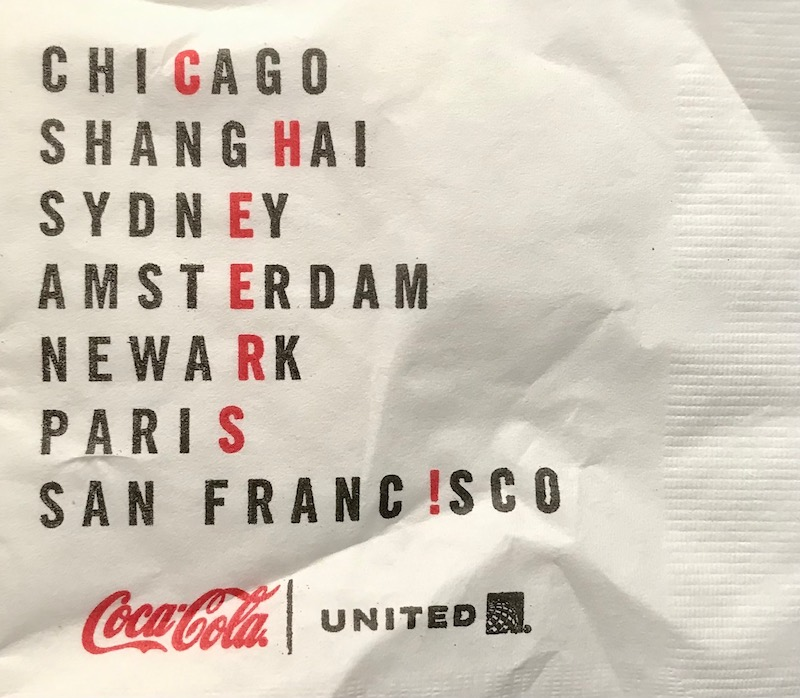

# Cheers!
A quick project to fix the acrostic on this United Airlines cocktail napkin:



- [Web page](https://codywinchester.com/cheers)
- [Python script](https://github.com/cjwinchester/cheers/blob/main/noodle.py)

The goal of the Python script was to create and export a JSON object with the top-level keys being the index position of the column of interest (0 = first letter of each word, 1 = second letter of each word, etc.), and the values being a dict whose keys are the individual letters in "CHEERS" (so, "CHERS") and the values a list of cities that have that letter in that index position:

```json
{
    "0": {
        "C": ["CALGARY", "CHARLOTTE" ...],
        "H": ["HALIFAX", "HOUSTON", ...],
        "E": ["EDINBURGH", "EVERETT", ...],
        "R": ["REDMOND", "RAPID CITY", ...],
        "S": ["SACRAMENTO", "STOCKHOLM", ...]
    },
    "1": {
        "C": ["ACAPULCO", "ACCRA", ...],
        "H": ["CHARLESTON", "CHARLOTTE", ...],
        "E": ["BEIJING", "BELFAST", ...],
        "R": ["BRIDGETOWN", "BRISBANE", ...],
        "S": ["ISTANBUL", "OSAKA", ...]
    }, ...
}
```